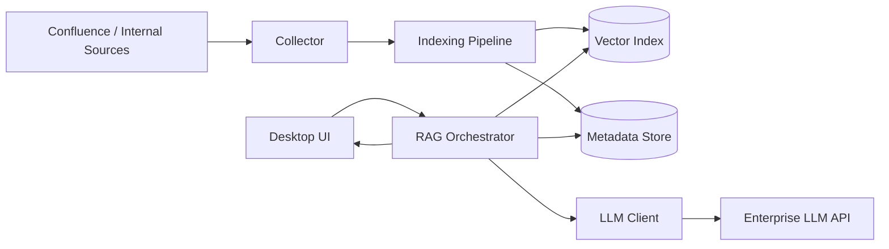

# Curator Desktop Architecture

## High-level System Diagram

## Component Responsibilities

### 1) 수집(Collector)
- Confluence API를 주기적으로 호출해 문서 변경분을 가져옵니다.
- 증분 동기화 기준 시각(`last_synced_at`)을 이용해 변경된 페이지만 수집합니다.
- API 제한(1초 1회)을 준수하기 위해 호출 간 간격 제어를 수행합니다.

### 2) 인덱싱(Indexing Pipeline)
- 수집한 문서를 정규화(cleanup, chunking)합니다.
- 임베딩 생성 후 벡터 인덱스에 저장합니다.
- 문서 ID, 업데이트 시각, 출처 URL 같은 메타데이터는 별도 저장소에 저장합니다.

### 3) RAG 오케스트레이터
- 사용자 질문을 받아 관련 문서를 벡터 검색으로 조회합니다.
- 검색 결과를 프롬프트 컨텍스트로 조합하고 LLM 호출을 수행합니다.
- LLM 장애/타임아웃 시 UI에 전달할 표준 에러 형태로 변환합니다.

### 4) LLM 클라이언트
- 사내 LLM 게이트웨이(또는 OpenAI 호환 API)와 통신합니다.
- 인증 에러, 타임아웃, 일시적 네트워크 오류를 분류해 재시도 또는 사용자 메시지 정책을 적용합니다.

### 5) UI(Desktop)
- 설정(Backend URL, API Key 등)을 로컬에 저장하고 불러옵니다.
- 채팅 입력/응답 렌더링을 담당합니다.
- 연결 실패 시 재시도 버튼과 명확한 오류 안내를 제공합니다.
